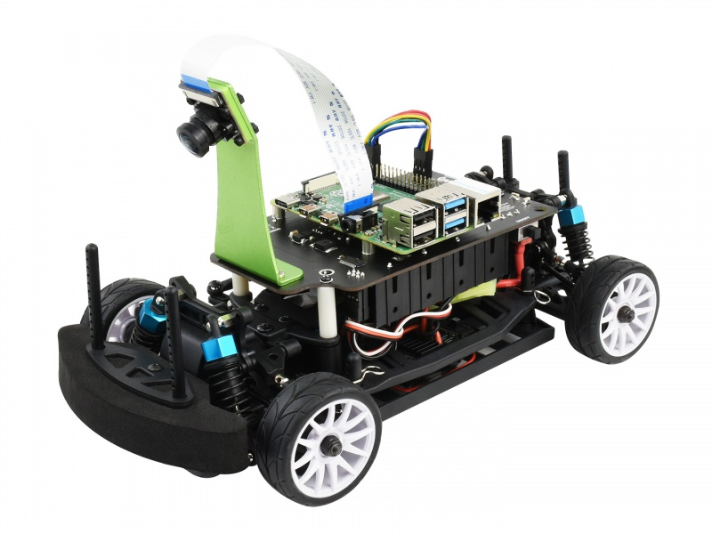
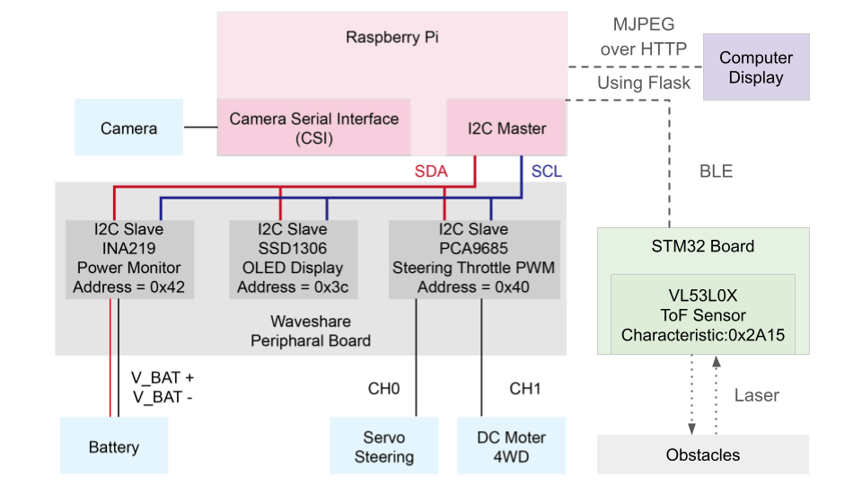

# ES Lab Final Project : Smart Parking Project

## Concept and Motivation

Driving in Taipei is an integral part of daily life but often comes with its own set of challenges and dangers. To address this, our project aims to design a smart driving assistance system. The goal is to provide real-time alerts about the direction and distance of surrounding objects, offer instructions and help for making safe navigational decisions, and present information in an intuitive visual format to enhance safety on the roads.

## Main Functionalities

Our project focuses on several key functionalities to achieve this goal:

- **Realtime Measurement**: Measure and display distance, acceleration, and angular data in real-time.
- **Driving Mode**: Switch between Normal Driving and Parking Mode for different driving scenarios.
- **Danger Detection**: Provide warning messages and control brakes to prevent potential hazards.
- **Screen Display**: Show First Person View (FPV) scenes, current mode, and messages on a screen for easy understanding.
- **Auto Parking**: Implement machine learning algorithms for an efficient auto parking system.

## Hardware Setup

The robot's hardware is based on the PiRacer Pro, a versatile and powerful robot car designed for Raspberry Pi. 

I followed the detailed instructions in the *PiRacer Pro AI Kit Assembly Tutorial* PDF provided by Waveshare to assemble the robot. This document is a valuable resource for anyone setting up their PiRacer Pro, covering everything from assembly to initial hardware testing.

#### https://www.waveshare.com/wiki/PiRacer_Pro_AI_Kit

### **This is our initial setup:**



### Architecture Overview

Below is an overview of the architecture of the our setup:




## Software Setup

To get started with the software setup for the PiRacer Pro Robot Project, follow these steps:

### Raspberry Pi OS Setup

1. **Download and Install Raspberry Pi OS**:
   - Use the 64-bit Raspberry Pi OS Bullseye.
   - Download it onto your SD card using the Raspberry Pi Imager.

2. **Update the Raspberry Pi**:
   - Insert the SD card into your Raspberry Pi and power it on.
   - Open a terminal and run the following commands to update the system:
     ```
     sudo apt-get update --allow-releaseinfo-change
     sudo apt-get upgrade
     ```

3. **Configure Raspberry Pi Settings**:
   - Run `sudo raspi-config` in the terminal.
   - Enable Interfacing Options -> I2C.
   - Select Advanced Options -> Expand Filesystem to use the full SD card storage.

### Environment Setup

1. **Create a Python Virtual Environment**:
   - Run the following commands in the terminal:
     ```
     python3 -m venv env --system-site-packages
     echo "source ~/env/bin/activate" >> ~/.bashrc
     source ~/.bashrc
     sudo apt install libcap-dev
     ```

2. **Install Donkey Car Python Code (Optional for Development)**:
   - This step is useful if you are interested in the development of Donkey Car by Autorope.
   - Run the following commands:
     ```
     mkdir projects
     cd projects
     git clone https://github.com/autorope/donkeycar
     cd donkeycar
     git checkout main
     pip install -e .[pi]
     ```

### Project Code Setup

1. **Clone the Project Repository**:
   - Run the following command to clone my project repository:
     ```
     git clone https://github.com/lawraa/ESLab_SmartParking.git
     ```
   - Create the environment using the same steps as in the 'Environment Setup' section.

2. **Install Dependencies**:
   - Ensure your system is up to date and install the necessary packages:
     ```
     sudo apt update
     sudo apt install gcc v4l-utils i2c-tools raspi-config python3-dev python3-setuptools python3-venv libopencv-dev
     ```
   - Navigate to the project directory and install Python dependencies:
     ```
     pip install -r requirements.txt
     ```

## Running the Project

Once you have set up the software environment and dependencies, follow these steps to run the project and control the PiRacer Pro:

1. **Navigate to the Project Directory**:
     ```
     cd ESLab_SmartParking
     ```

2. **Configure the Flask Application**:
- Open the `car_controller.py` file using a text editor like Vim:
  ```
  vim car_controller.py
  ```
- Change the host IP address and port in the `run_flask_app` function to match your setup:
  ```python
  def run_flask_app():
      display_live.app.run(host='your-ip-address', port=your-port)
  ```
- Replace `'your-ip-address'` and `'your-port'` with your desired IP and port.

3. **Run the Controller**:
- Start the car controller script:
  ```
  python car_controller.py
  ```
- This will enable you to control the car.

4. **Access the Live Feed**:
- Open a web browser and go to `http://your-ip-address:your-port/video_feed` to see the live feed from the car.
- Example: `http://172.20.10.2:8082/video_feed`

5. **Troubleshooting BLE Connection**:
- If the BLE fails to connect on the first attempt, re-run the `car_controller.py` script.
- It might require running the script twice for a successful connection.

---

Remember to replace `'your-ip-address'` and `'your-port'` with the actual IP address of your Raspberry Pi and the port number you configured in `car_controller.py`. This will ensure that the Flask application runs correctly and you can access the live feed from the car.


